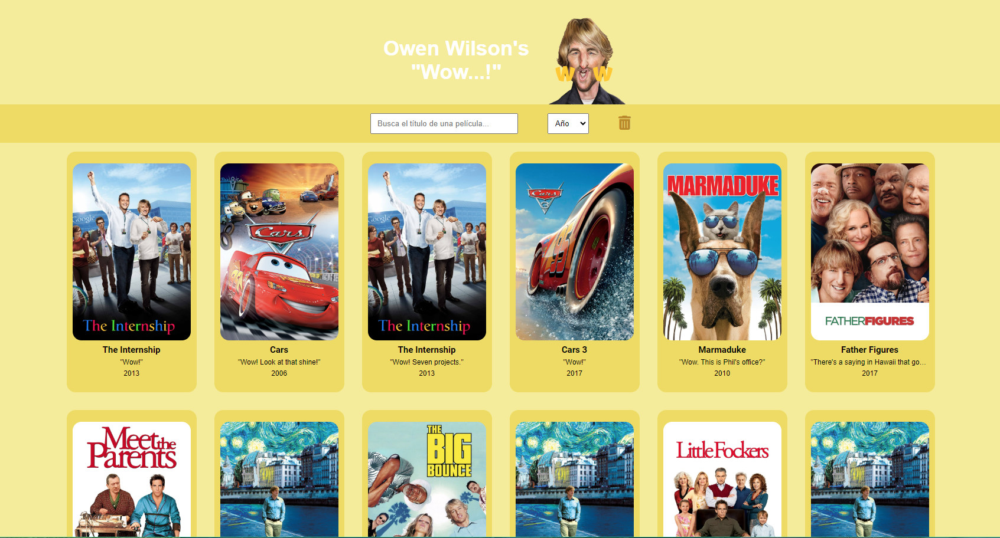
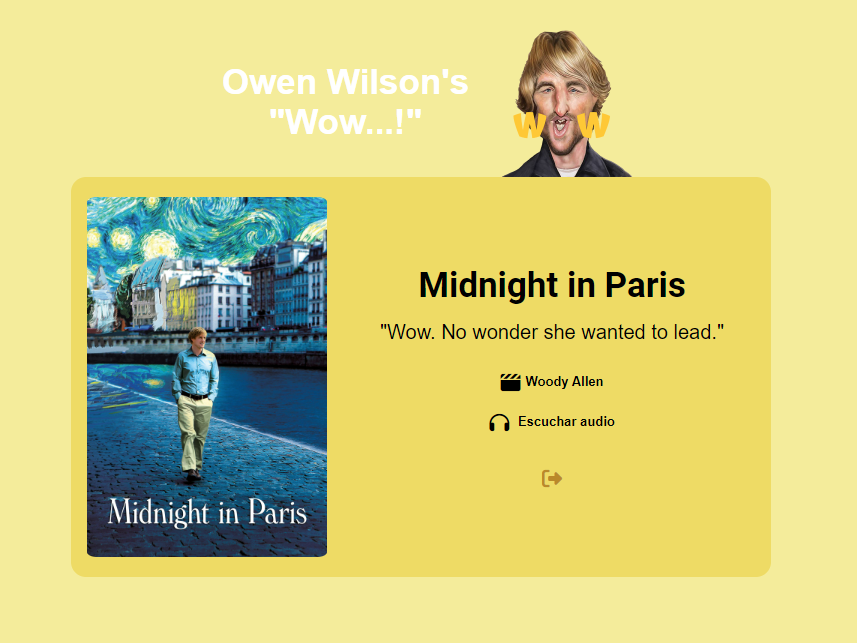

#React website: Owen Wilson movies.

## Search website where he says "wow..!"

I can now create some awesome interactive web apps using React✨. This is my new React website where you can search and read some information where Owen Wilson says "Wow..!" Wilson has used the word “wow” in 27 movies, about 81 times. And he's appeared in 52 movies, so statistically, he says "wow" in 51.9% of them.

## 📋 Initial Requeriments

- Create a react app
- The app must fetch from **"The Owen Wilson Wow Api"**
- Render the movies where Owen has said "wow". Required information is: Picture, name and year.
- Adds two filters that allow the user to search by movie title and year.

## 🌟 Quality Requirements

- Semantic must be right.
- When the user filters if it press the enter key nothing must happen.
- If the user searches for a non-existent movie it should display a message like this: "There are no matches for the word "ZZZ". Try again!" I added a very funny gif, check it out!
- The filter must work either if the user writes with caps on or not.
- When in the character detail if the user wants to go back to the home page the search input value must remain.

## My own extra features 👩‍🎤

- Add a reset button that resets the filters values
  
### Components

- App
- Filters
  - FilterByMovie
  - FilterByYear
- MovieSceneList
  - MovieSeceneItem
- MovieDetail

## 🔨 Built with 

- **Visual Studio Code**
- **HTML**
- **SASS** 
- **React**

## ✏️ Do you have any idea? 

I'm an student and as I stated before am learning a whole lot of Front End Developing, so, if  you have any idea that I could develope please tell me so and I will try to.

### Autor

[)](https://github.com/crisrodriguezgar)

Enjoy it!

